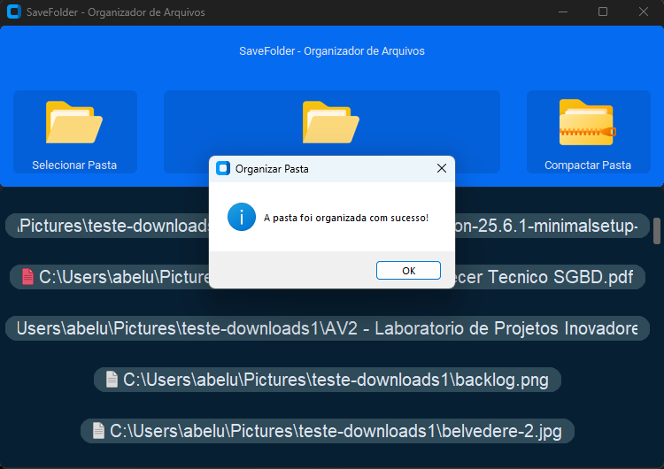

# SaveFolder
### 🚧⚠️ Em desenvolvimento... ⚠️🚧

O **SaveFolder** é um organizador automático de arquivos que classifica arquivos por tipo e formato e separa por pastas, além de oferecer um sistema de compactação de pastas e criptografia de arquivos com proteção por senha utilizando criptografia **AES**, garantindo segurança e confidencialidade alem de fornecer organização à estrutura de pastas dos seus projetos, tornando o gerenciamento de arquivos mais eficiente e seguro.

Ele auxilia evitando perda de dados, arquivos duplicados, desperdício de tempo e armazenamento desorganizado, garantindo uma **organização sistemática, categorização inteligente, armazenamento otimizado e rápida recuperação das informações**. Dessa forma, reduz o trabalho manual e a ocorrência de erros, além de assegurar que os arquivos estejam sempre disponíveis quando necessário.  

Com uma interface simples e intuitiva, o **SaveFolder** foi pensado para facilitar o trabalho de qualquer usuário que precise manter seus arquivos organizados e protegidos, sem depender de processos manuais demorados. A solução combina eficiência, segurança e usabilidade em um único aplicativo desenvolvido em **Python** com **Pathlib**, **CustomTkinter**, **Pyzipper** e **Pillow**.
 

### Resultado
### 🚧⚠️ Em Desenvolvimento ⚠️🚧
 

